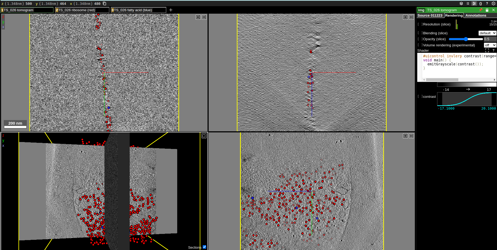

# cyro-et-neuroglancer

## User guide

This repository is very out of date, and only really the examples should be given any heed. The code instead now lives at https://github.com/chanzuckerberg/cryoet-data-portal-neuroglancer.

### Installation

```bash
git clone https://github.com/MetaCell/cyroet-neuroglancer
cd cyroet-neuroglancer
pip install cyro-et-neuroglancer
```

### Usage

```bash
cryoet-converter --help
```

### Examples

See the examples folder for bash scripts that create all the necessary files for a neuroglancer viewer from a cryo-ET dataset.

### Annotations

`./examples/convert_and_view_image_and_annotations.sh`



### Segmentation

`./examples/convert_and_view_image_and_segmentation.sh`


### Oriented points

`./examples/convert_and_view_oriented_points.sh`


### Components

There are three parts to this package:

1. The first part of the package is designed to convert a cryo-ET dataset into a format that can be viewed in neuroglancer. The commands `encode-segmentation` and `encode-annotation` are used here.
2. The second part of the package is designed to view the converted dataset in neuroglancer. The commands `create_image`, `create_segmentation`, and `create_annotation` are used here. Each of these produce a JSON file that represents a neuroglancer layer. The layers can then be combined into a single neuroglancer viewer state via the `combine-json` command.
3. The final part of this package is designed to help quickly grab the JSON state or URL of a locally running neuroglancer instance, or setup a local viewer with a state. The commands `load-state` and `create-url` are used here.

## Development

### Developer installation

```bash
git clone https://github.com/MetaCell/cyroet-neuroglancer
cd cyroet-neuroglancer
pip install -e ".[dev]"
pre-commit install
```

### Pre-commit hooks

To run all pre-commit hooks on all files run:

```bash
pre-commit run --all-files
```

This will lint via `ruff`, format via `ruff` (essentially `black`), and check mypy types with the arguments specified in `.pre-commit-config.yaml`.

### Testing

```bash
pytest
```

### Mypy

Manual type checking with mypy:

```bash
mypy .
```
